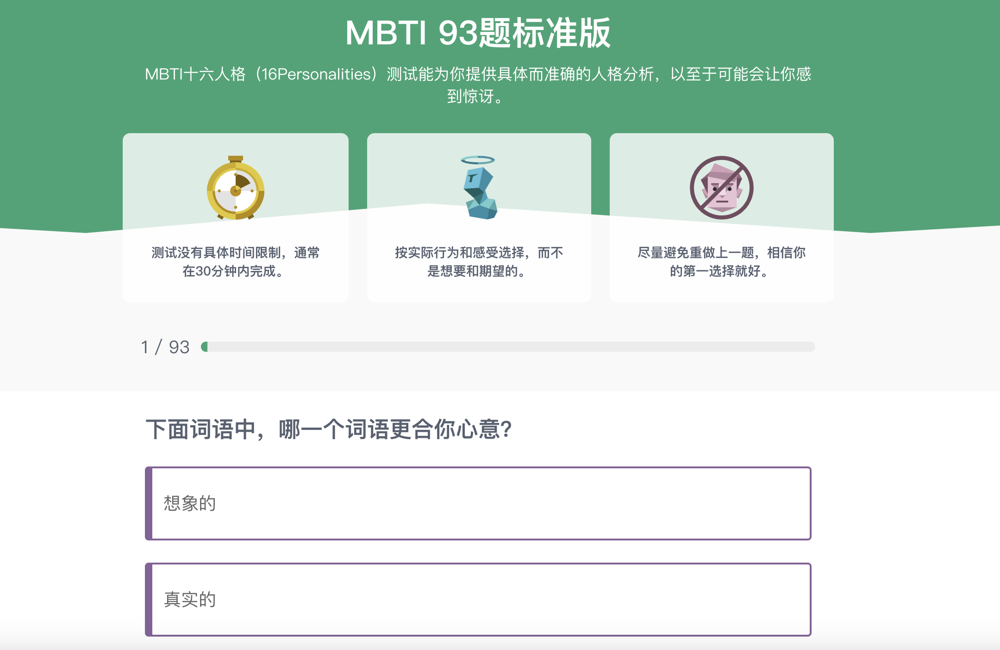

# MBTI性格测试系统

## 项目简介
MBTI性格测试系统是一个基于Vue和Go实现的完整的MBTI（迈尔斯-布里格斯类型指标）测试平台。系统提供专业的MBTI测试题目，并通过DeepSeek API生成个性化的测试报告。

## 功能特点
- 专业的MBTI测试题库
- 实时计算MBTI类型
- AI驱动的个性化报告生成
- 美观的用户界面
- 测试结果分享功能

## 技术栈
- 前端：Vue.js + uni-app
- 后端：Go + Gin
- 数据库：MySQL
- AI服务：DeepSeek API

## 快速开始

### 前端启动
```bash
# 安装依赖
npm install

# 开发模式运行（H5）
npm run dev:h5

# 打包
npm run build:h5
```

### 后端启动
1. 配置数据库
```bash
# 导入数据库结构
mysql -u root -p < server/init.sql
```

2. 配置环境变量
复制 `server/.env.example` 到 `server/.env` 并填写相关配置：
- 数据库连接信息
- DeepSeek API密钥

3. 启动服务器
```bash
cd server
go run .
```

## 系统截图
- 测试页面


- 提交结果


- 结果页面


## 许可证
MIT License
